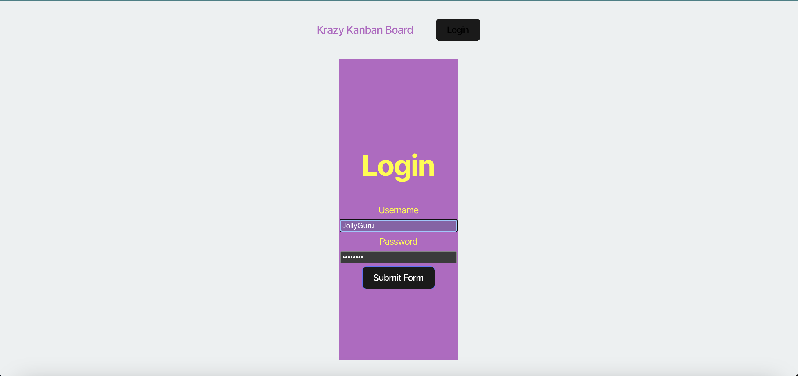
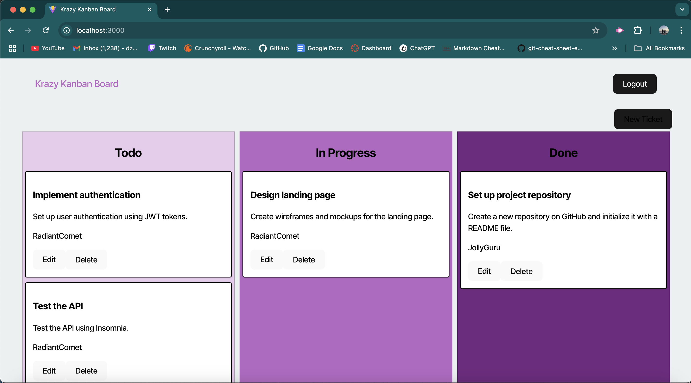

  # Krazy Kanban Board
  
  
  
  ## About

  The Krazy Kanban Board is a full stack application that provides utility in project originization. It helps teams organize project to-dos and stay on task.
   

   
  ## Table of Contents 
  - [Installation](#installation)
  - [Usage](#usage)
  - [Contributing](#contributing)
  - [Tests](#tests)
  - [License](#license)
  - [Questions](#questions)
   

   
  ## Installation
   
  Here are the prerequisites necessary to use the project:
   
  *Nothing but access to a browser and an internet connection!*
  
  To get started with the project, follow these steps:
   
  No installation is necessary for this application. Simply visit the deployed website [here]()
   

   
  ## Usage 
   
  To use the application, do the following:

  When the website loads you will be prompted to log in. At the moment there are pre set logins seeded in the database. So for username, use “JollyGuru” and password is “password”. The application uses JWTs for smooth authentication. 

  

Once logged in you will see the Krazy Kanban board filled out with placeholder data. Each box has a functioning delete button on the bottom of the cards and an edit button that allows you to change a cards title, content, and placement. Pressing the black “New Ticket” button on the top right of the home page will allow you to create a new card.

 

    
  ## Contributing
   
  Any contributions are appreciated as they are vital to the improvement and wellbeing of the project.

  If you would like to contribute, please follow these steps:

  1. **Fork the repository** to your own github account
2. **Clone the forked repository** to your local machine
3. **Create a branch** for your changes
4. **Install dependencies**, type npm install in the terminal of the code editor to install all packages required for the application (Nodejs required)
5. **Make your changes**, while ensuring they follow the project’s standards
6. **Test your changes** to verify they work
7. **Commit your changes** with a descriptive commit message
8. **Push the changes** to your forked repository
9. **Submit a pull request** from your branch to the main repository with a detailed description of the changes and any potential issues.
10. **Be responsive to feedback** and make any updates necessary.

   

   
  ## Tests
   
  In order to run tests on the project, do the following:
   
  *Tests are not yet available for this project*
   

   
  ## License 
   
  This application is covered under the MIT License. For more information, view the official documentation [here](https://opensource.org/license/MIT).
   

   
  ## Questions
   
  For any questions or assistance, please reach out through these mediums:
   
  - **Github:** [zachmc27](https://github.com/zachmc27)
  - **Email:** <zmcgregor344@gmail.com>

  